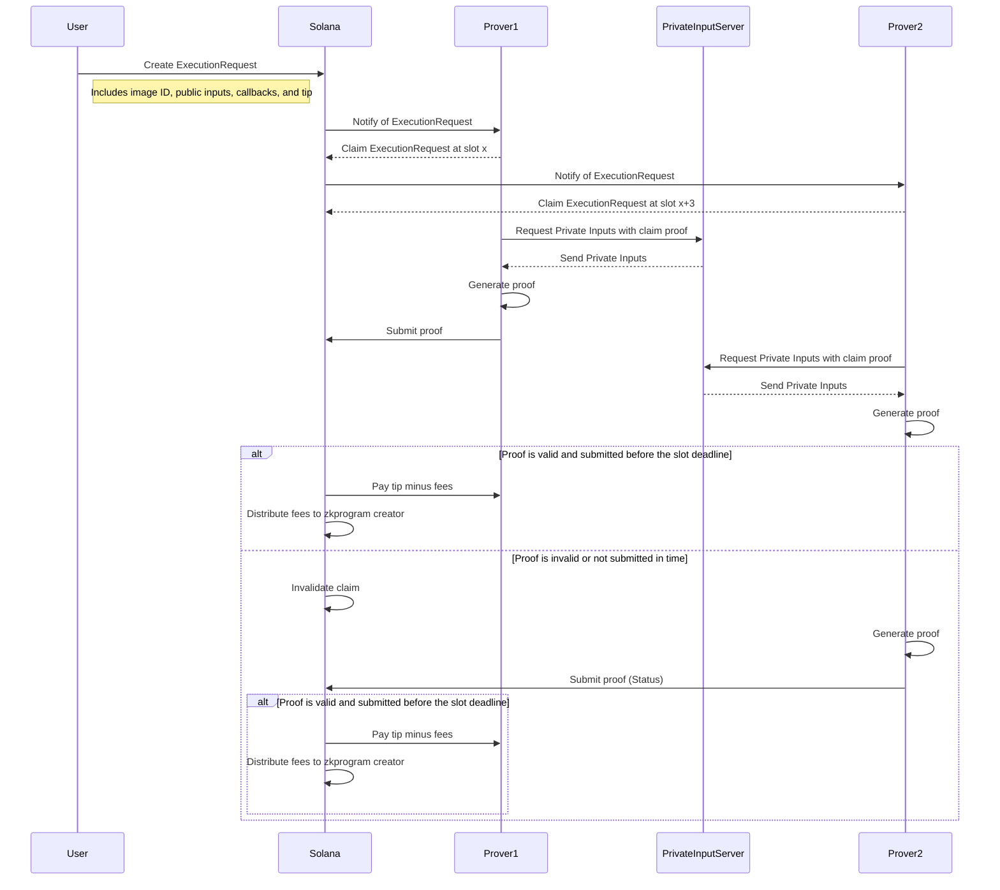

# 乃ㄖ几丂ㄖㄥ-ZK Plumbing on solana

As you can see from the above copy pasted AI image bonsol is the hearts desire of Solana silly dragon developers. It is a ZK "co processor" (fancy word for a server that listens to a blochain and does stuff the chain cant do and then puts the results of those heavy lift operations on said blockchain).

BonSol currently allows you to run any risc0 image (program thingy, we will call this a zkprogram from now on) and verify it on solana. This works by allowing a user to create and `ExecutionRequest` with an image id, public inputs, any program callbacks(other solana programs can be called upon a valid proof) and a tip. A prover will act fast to `Claim` and will make a commitment produce a proof and submit the proof by the slot deadline with the `Status` . The Bonsol on chain solana program will then verify the proof and if it is valid will pay the prover the tip minus a small fee for the zkprogram creator and some "hand waive" auction or time based mechanic to incentivise provers to provide quality service. If the prover doesnt produce a proof in time, their claim will be invalidated and another prover can claim the execution request and try to produce a proof. Up until the slot deadline. 

#### Claim???
Wait dude why does the prover have to claim before they can start to prove? Well I have a simple answer but you wont like it. Because in the future I want to allow the private inputs to be encrypted so that only the claim winner can have access to the private inputs and I literally dont even know where to start with Homomorphic Encryption inside a ZKvm. FHE is not some silver bullet okay .... The claim mechaism allows "fair" access to the tip. Claims are recorded in order of their slot and multiple provers can have claims. The prover that produces a valid proof within their promised claim window will be paid the tip. The private input server MUST only allow the provers that have submitted a claim the execution request to access the private inputs. They do this by making sure the private input request is signed by the same Key that submitted the claim.

#### "hand waive" auction or time based mechanic to incentivise provers to provide quality service
This is a sarcastic way of saying that im still figuring this out but I think it will be something like.

Users tip decreases in value from the time a prover claims it. At the slot the prover claims the execution request the tip is at its highest value. And it decreases in value until the slot deadline.

Not producing a proof will result in a loss of claim and a different prover can submit. If the prover submits a proof that is invalid they get some of their stake for that execution slashed. 

I would love feedback on if this is a good idea or not. I think it will incentivise provers to act fast and produce a proof quickly and the proof stake slashing will incentivise provers to produce quality proofs.

### Public Inputs
Public inputs come in a few forms. Bonsol will allow the following types of public inputs.
* `PUBLIC_DATA` - A byte array that is passed in the execution request. 
* `PUBLIC_ACCOUNT` - The data contents of a solana account that is passed in the execution request. The prover will pull this account data from the solana blockchain and use it as a public input.
* `PUBLIC_URL` - A url that the prover will pull data from and use as a public input. (this is for large inputs that are too large to fit in a solana account. make sure you tip your provers people as they will check the size of the data they need to pull and if the tip is not worth the time and resources they will not claim the execution request. Its important the server hosting the data returns the `content-length` header so the prover can check the size of the data before they claim the execution request.

### Private Inputs
If the zkprogram has private inputs then simultaneosly the user will send private inputs to a server hosted by the zkprogram creator. I know what your thinking!! Why would I trust the zkprogram creator with my private inputs? Well until I get time to implement a MPC encryption scheme in bonsol that allows private inputs to be handled without another third party your locus of trust is the zkprogram creator. After all you are trusting that they wrote the program you want. If you dont trust them then dont use their program. 

In the most likley scenario, you as the developer will be the zkprogram creator and you will be the one hosting the server that handles the private inputs. The server that handles the private inputs is extremly simple and require nothing more than function as a service level compute. Meanwhile the provers are doing the heavy lifting and will compete on speed to claim and produce the proof. The prover servers will likley be "chonky bois" with "blazing fast" gpus and internet connections.

## Development Status
* Proving and verifying a proof: works
* Execution Request: works
* Claiming: in progress
* Private Inputs: in progress
* Fee distribution: basic
