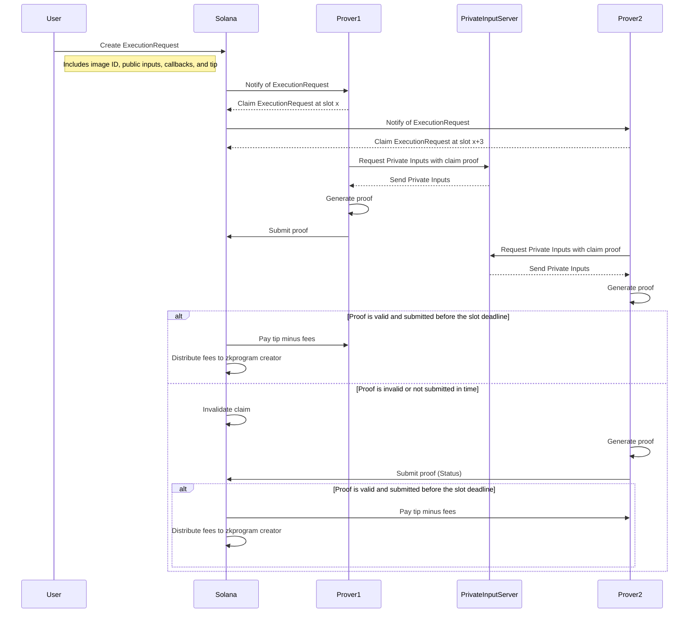

# 乃ㄖ几丂ㄖㄥ-ZK Plumbing on solana

As you can see from the above copy pasted AI image 乃ㄖ几丂ㄖㄥ is the hearts desire of Solana silly dragon developers. It is a ZK "co processor" (fancy word for a server that listens to a blockhain and does stuff the chain cant do and then puts the results of those heavy lift operations on said blockchain).

乃ㄖ几丂ㄖㄥ currently allows you to run any "risc0 image" (its a program thingy, we will call this a zkprogram from now on) and verify it on solana. This works by allowing a user to create and `ExecutionRequest` with an image id, public/private inputs, any program callbacks(other solana programs can be called upon a valid proof) and a tip. A prover will act fast to `Claim` and will make a commitment produce a proof and submit the proof by the slot deadline with the `Status` . The 乃ㄖ几丂ㄖㄥ on chain solana program will then verify the proof and if it is valid will pay the prover the tip minus a small fee for the zkprogram creator and some "hand waive" auction or time based mechanic to incentivise provers to provide quality service. If the prover doesnt produce a proof in time, their claim will be invalidated and another prover can claim the execution request and try to produce a proof. Up until the slot deadline. 



#### Claim???
Wait dude why does the prover have to claim before they can start to prove? Well I have a simple answer but you wont like it. Because in the future I want to allow the private inputs to be encrypted so that only the claim winner can have access to the private inputs and I literally dont even know where to start with Homomorphic Encryption inside a ZKvm. FHE is not some silver bullet okay .... The claim mechaism allows "fair" access to the tip. Claims are recorded in order of their slot and multiple provers can have claims. But only one at a time. The prover that produces a valid proof within their promised claim window will be paid the tip. The private input server MUST only allow the provers that have submitted a claim the execution request to access the private inputs. They do this by making sure the private input request is signed by the same Key that submitted the claim.

I am open to different network models here, things I explored:

Stake base job distrobution,
Proof of work,
Just a straight up auction


#### "hand waive" auction or time based mechanic to incentivise provers to provide quality service
This is a sarcastic way of saying that im still figuring this out but I think it will be something like.

Users tip decreases in value from the time a prover claims it. At the slot the prover claims the execution request the tip is at its highest value. And it decreases in value until the slot deadline.

Not producing a proof will result in a loss of claim and a different prover can submit. If the prover submits a proof that is invalid they get some of their stake for that execution slashed. 

When a claim starts there is a curve that the paid out tip will decrease over. If a prover misses their window or provides a bad proof, then any prover that is not the previous can claim and the tip value resets and the curve starts over. This is all until the slot deadline.

I would love feedback on if this is a good idea or not. I think it will incentivise provers to act fast and produce a proof quickly and the proof stake slashing will incentivise provers to produce quality proofs.


### Inputs
乃ㄖ几丂ㄖㄥ flavored zkprograms have two types of inputs. Public and Private. Private inputs are not required and the zkprogram creator can choose to only have public inputs.
They are easy because they are public and can be passed in the execution request either by value or by refernce. 
You can also pass an `InputSet` which is a preconfigured set of private or public inputs. This is useful for use cases where many inputs are known but a final end user input is not known. 
For example a use case where a zkprogram dev (thats prolly you) has an application that needs the public key and a signature from a user when they click something, but the rest of the input are already known. You can create an input set of those inputs that will be used for those input slots and the users inputs for the unknown ones.


### Public Inputs
Public inputs come in a few forms. 乃ㄖ几丂ㄖㄥ will allow the following types of public inputs.
* `PUBLIC_DATA` - A byte array that is passed in the execution request. 
* `PUBLIC_ACCOUNT` - The data contents of a solana account that is passed in the execution request. The prover will pull this account data from the solana blockchain and use it as a public input.
* `PUBLIC_URL` - A url that the prover will pull data from and use as a public input. (this is for large inputs that are too large to fit in a solana account. make sure you tip your provers people as they will check the size of the data they need to pull and if the tip is not worth the time and resources they will not claim the execution request. Its important the server hosting the data returns the `content-length` header so the prover can check the size of the data before they claim the execution request.

### Private Inputs
If the zkprogram has private inputs then simultaneosly the user will send private inputs to a server. This server can be run by the user, the zkprogram creator or any third party that the user trusts.
Bonsol currently has a provision for the zkprogram creator to put a url in the zkprogram manifest that the user can use to send the private inputs to. Although this is not required. I suspect this will chage drastically and we will soon have some aweseome MPC encryption scheme that will allow the private inputs to be handled without another third party.

I know what your thinking!! "I have to trust some server?!!!" Well until I get time to implement a MPC encryption scheme in 乃ㄖ几丂ㄖㄥ that allows private inputs to be handled without another third party your locus of trust is the zkprogram creator and whoever holds the private inputs. After all you are trusting that they wrote the program you want. If you dont trust them then dont use their program. 

In the most likley scenario, you as the developer will be the zkprogram creator and you will be the one hosting the server that handles the private inputs. The server that handles the private inputs is extremly simple and require nothing more than function as a service level compute. Meanwhile the provers are doing the heavy lifting and will compete on speed to claim and produce the proof. The prover servers will likley be "chonky bois" with "blazing fast" gpus and internet connections. To put it in degenerate terms the private input server is the "simp" and the prover servers are the "chads". The private input server can run on vercel, cloudflare workers, aws lambda, google cloud functions, or a raspberry pi in your closet with an ngrok tunnel hopfully still on.

Would love some feedback on this.

## On writing 乃ㄖ几丂ㄖㄥ flavored zkprograms
In risc0 there are the concepts of `guest` and `host`. From the guest perspective it has no notion of private/public inputs. It is simply a program that takes some inputs and produces some outputs. The host is the program that will call the guest and provide the inputs and recieve the outputs. The host is the 乃ㄖ几丂ㄖㄥ relayer and in order for it to properly secure the zk execution its of the upmost importance that the zkprogram commit to a Digest (the akkkkkktually correct term for a hash) of all the inputs. 
This is done like this

```rust

use gjson::Kind;
use risc0_zkvm::{guest::{env, sha::Impl},sha::{Digest, Sha256}};

fn main() {
    // The Bonsol Host will send your inputs packed in a Vec<u8> 
    let mut public1 = Vec::new();
    env::read_slice(&mut public1);
    let publici1 = String::from_utf8(public1).unwrap();
    let mut private2 = Vec::new();
    env::read_slice(&mut private2);
    let privatei2 = String::from_utf8(private2).unwrap();
    
    let valid = gjson::valid(&publici1);
    let mut res = false;
    if valid {
        let val = gjson::get(&publici1, "attestation");
        if val.kind() == Kind::String && val.str() == privatei2 {
            res = true;
        }
    }
    let digest = Impl::hash_bytes(
        &[
            publici1.as_bytes(),
            privatei2.as_bytes(),
        ].concat(),
    );
    env::commit_slice(digest.as_bytes());
    env::commit_slice(&[res as u8]);
}

```
Specifically 

```rust
use risc0_zkvm::{guest::{env, sha::Impl},sha::{Digest, Sha256}};
...
let digest = Impl::hash_bytes(
        &[
            publici1.as_bytes(),
            privatei2.as_bytes(),
        ].concat(),
    );
env::commit_slice(digest.as_bytes());
```
You can see that in the guest program we are hashing the public and private inputs and commiting the hash to the zkvm. This is how we insure that the prover ran this over your actual imput data which you previously hashed and sent into the execution request.
If your input is dynamic and you dont know the hash ahead of time you can turn off the verify_inputs flag in the execution request and the prover will not fail if the inputs dont match. This is useful for dynamic input types like dynamic website data. If you need to prove over dynamic data pulled from the web, the reccomendation is to pull that data from inside your zkprogram or to ensure you check the hash in your callback program after the fact.

# Roadmap
* More TXN sender configs
* More ingester configs
* Bonsolace: local proving with simple on chain verification(for devs who dont need the prover network)
* Zkprogram capacity (compute) calculations and capacity planning for provers: in progress
* non trivial example zkprograms: in progress
* MPC encryption for private inputs to avoid private input server 
* Auction or time based mechanic to incentivise provers to provide quality service
* Other proof systems SP1, Spartan etc ...
* More dynamic input types
    * Solana transaction history
    * Interactive Browser Proofs
    * Zk Compressed State
    * Nonced Risc0/Bonsol Proofs to allow composition of proofs

## Local Development
Prequisites:
risc0 tooling
docker
rust
solana tooling
probbably a fast computer

You will need to run a few components.

1. Solana validator localnet
2. 乃ㄖ几丂ㄖㄥ on chain program
3. 乃ㄖ几丂ㄖㄥ off chain relay
4. 乃ㄖ几丂ㄖㄥ zkprogram compiler 
5. (Soon) Private input server (optional)

```bash
#Download and setup the system with the needed binaries and keys to run the groth16 prover over the risc0 FRI
./setup.sh

#Compiles the 乃ㄖ几丂ㄖㄥ on chain program and starts a localnet with the program loaded
./validator.sh 

#Compiles the 乃ㄖ几丂ㄖㄥ off chain relay and starts it
./run-relay.sh

#Compiles any local 乃ㄖ几丂ㄖㄥ zkprograms
./build-images.sh 
```

Currently I have the following flow:
I run "./build-images.sh".

Then "./validator" and "./run-relay.sh" , and run the ts-client tests in `channel` directory with `pnpm test` in three different terminals. This will deploy a zk program and start an execution request which the relay will respond to.


# Running a Prover Node
The prover node is a binary that comes from the relay package. You configure it with the Node.toml file. There are a variety of options in there. `relay/src/config.rs` shows all the configurations. There are alot of defaults.
The key parts are the keypair, transaction sender and the ingester config. Because the groth16 prover is a heavy process the node that you run the prover on needs to allow alow a high stack limit. In the `./run-relay.sh` we use `ulimit -s unlimited` to allow the prover to run.
You will need a relay keypair in order for the node to function, and this keypar must have some SOL in it for JIT staking of Execution requests and for sol transaction fees.

You can make a new keypair using the solana cli tools.
`
solana-keygen new -o relay-keypair.json
`
Fund that keypair with sol, and keep it secret, currently we only support the local keypair signing, but in the future other options will be available, such as remote signing from an hsm device or a mpc signer cluster.

# Deploying the Helm Chart 
A helm chart exists for this project. You can deploy it to a kubernetes cluster. You will need to have a kubernetes cluster and helm installed. 
```bash
helm install --set-file signer_config.local_signer_keypair_content=relaykp.json bonsol ./charts/bonsol-node -f ./charts/bonsol-node/secret-values.yaml
```
Ensure you set ```local_signer_keypair_content``` with the content of the relay kp. An example values file is in the helm directory at ```example-values.yaml```.

In a production scenario you will want to use the ```GrpcSubscription``` ingester type to avoid the need for a colocated Solana node. Triton One or Helius offer GRPC streams of solana transactions. We reccomend triton for this as they created the Yellowstone library in use for the Grpc Ingest option in this prover node.

## Running Tests
There are a few tests in the `onchain/channel/ts-client` directory. You can run them with `pnpm test`. This will deploy a zk program and start an execution request which the relay will respond to.
In a locall environment you need to run `solana-test-validator` and then airdrop some money to your relay keypair `solana -u http://localhost:8899 airdrop 1 --keypair relaykp.json`. Then you can run the tests.

For a public network jsut set the `KP` and `RPC_ENDPOINT` env variables to the path of your keypair and run the tests.

