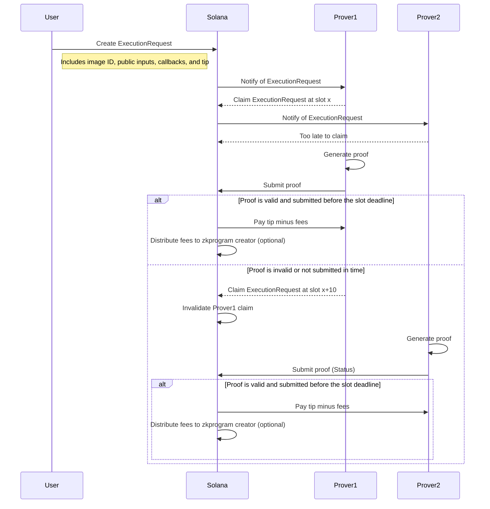
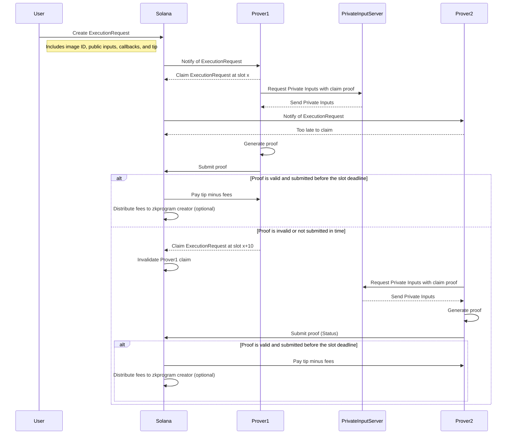

# Bonsol Architecture
Bonsol is a framework for building verfiable computation on Solana. It is a set of tools and libraries that allow developers to build their own zkprograms and prove computations that are impossible to run on-chain, but it also is a prover network to allow those computations to be run by a distributed network of provers, incentivized to run them as fast as possible. This works by a claim mechanism, in which the provers watch the blockchain for execution requests and if they see a request they like, will claim it and send the proof to the blockchain. By `like` we mean they have various heuristics to determine if the request is woth claiming, to them. The first prover to claim the request will have a certain amount of time, in blocks, to send the proof. This deadline must be less than the expiry of the execution request. If the prover fails to claim the request within the deadline, the request expires and the claim is invalid. Another prover can then claim the request and send the proof.
As soon as the claim is made, the execution request is marked as claimed and the value of the tip goes down according to a curve, to incentivize the prover to produce a proof quickly.

As the readme says this is a first cut of the compute acution or incentivized computation network, we are researching the best incentive model for this network.

## Components
Bonsol has two main components, the prover and the verifier, and various supporting components. An optional component is the Private Input Server which is used to request private inputs from the user. Another optional component is the callback program which is used to perform side effects on the event of a successful proof.

### The Prover
The prover is a node that runs the Bonsol network. These nodes work as relayers, they listen for transactions on the Solana blockchain, dedcide if they want to prove the ExecutionRequest and if so they will send the proof to the Solana blockchain.

### The Verifier
The verifier is a program that runs on Solana. It is responsible for verifying the proof and forwarding the output to the callback program.

### The Callback Program
The callback program is brought by you the developer. It recieves the output from the verifier and can do anything you want with it.

### The Private Input Server
If your program requires private inputs, you can use the Private Input Server to request them from the user. It is a server that the developer may run so that an authenticated prover can grab the private inputs for the computation. This is just one strategy for using private, input, the other is to use proof composition where a user or party with the private data runs a local proof and utilizes the `PublicProof` input type.

### The program registry
Each deployed zkprogram(risc0 compiled guest image) has a record on chain that contains the image id, the image size, the required inputs and the url of the image. The url must be public and the contents of the response must verify against the image id and image size. This is to ensure the prover is pulling the correct image.

### Callflow Diagram

### Private Inputs
This callflow diagram shows the flow of a Bonsol execution request with a private input server.
