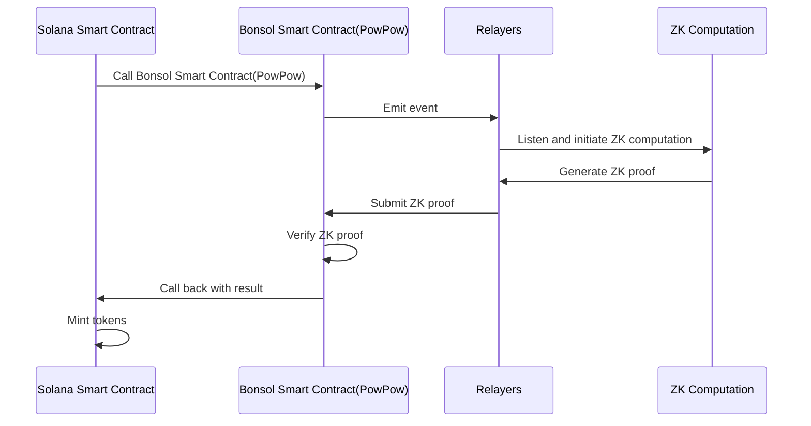

import Prereq from '../shared/prereq.mdx';
import InitNewBonsol from '../shared/init-new-bonsol.mdx';
import Build from '../shared/build.mdx';
import Deploy from '../shared/deploy.mdx';
import PowPowDemo from '@site/src/components/PowPowDemo';
import CliTip from '../shared/cli-tip.mdx';

# A Taste of Bonsol
The best way to learn about Bonsol is to use it. In this tutorial we will walk you through using a simple bonsol example and breaking down what is happening step by step.
But furst checkout the interactive demo to get started.

## Bonsol PoW Token
The following example is showcase of how you could use bonsol to build a Proof of Work Token on Solana. A proof of work system is a form of verifiable compute, which is the very thing that Bonsol was built for. Bonsol allows you to prove almost any kind of computation, with native verification on solana. That verification can be used to interact with other programs, and in this case, mint a token. Before we show you how this was built go ahead and use the interactive demo to mint yourself som PowPow tokens.
This fun little demo simulates the minig process for a Pow token, every pattern is different.
<PowPowDemo />

Congratulations! You have minted yourself some PowPow tokens.
Lets take a moment to break down what happened in this example.
When you clicked the Mint button you sent a transaction to the Solana blockchain. You sent it to the Bonsol PoW example program which then sent a message to the Bonsol Channel program to request a proof. A node in the prover network claimed that compute and rand the sequence for you, and then sent you a proof. The Bonsol Channel program then verified the proof and minted you and the node that provider the proof some PowPow tokens according to the difficulty of the sequence. While this is a contrived example it is a non trivial one that shows the folowing:
- Building a solana program that uses Bonsol
- Using Bonsol to prove a computation
- Builsing a Bonsol zk program 
- Creating a callback that bonsol Calls after the proof is verified
- Interacting with Bonsol on the frontend

Since this is a turotial we will break down each of these steps in detail. Starting with the creation of an Anchor program that uses Bonsol.

## Getting Started Quickly
If you want to skip all the mindless setup and get stright into a fully setup environment, try our GitPod for this demo here.

[PowPow GitPod](https://gitpod.io/#https://github.com/anagrambuild/bonsol-powpow)

## Building an Anchor Program that uses Bonsol
Get the latest version of anchor using `avm` and ensure you are using the correct version of rust and solana. At the time of writing this tutorial the version of anchor is 0.30.1 with the reccomended rust version is 1.79.0 and the solana version is 1.18.17.
<Prereq />

#### Building the Anchor Workspace
First we need to create a new anchor workspace. This is done by running the following command in the root of your project directory.
```bash
anchor init powpow
```
This will create a new directory called `powpow` and initialize a new anchor workspace in it. Your directory structure should look like this:
```
├── Anchor.toml
├── Cargo.lock
├── package.json
├── Cargo.toml
├── app
│   └── ...
├── programs
│   └── powpow
        ├── Xargo.toml
│       ├── Cargo.toml
│       └── src
│           └── lib.rs
├── tests
│   └── powpow.ts
... //other files
```

In lib.rs we will build out our program that requests execution from Bonsol and recieves the callback. 
You can see the full code for this example [here](https://github.com/anagrambuild/bonsol-powpow/tree/main/programs/bonsol-pow-pow/src/lib.rs).
We highly reccomend reading that code as the docs may drift from the implementation. The following will be a close approximation of the code.

Here is a diagram of how the program works.



We will break down a few parts of the code to show the bonsol specific parts. In `lib.rs` we have the following:

```rust
use bonsol_channel_interface::{
    macros:: {execute, execute_cb, callback},
    anchor::{
        BonsolChannel,
        DeploymentAccountV1, 
        ExecutionRequestV1,
    },
};

...
```
Here we import various macros and interfaces need to interact with the Bonsol channel program. 
The `execute` macro will request the execution of a desired program with specified inputs and the `callback` macro will recieve the callback from the Bonsol channel program.
The `BonsolChannel` interface is used to interact with the Bonsol channel program via anchor and the `DeploymentAccountV1` and `ExecutionRequestV1` allow convenient access to the accounts needed to interact with the Bonsol channel program.

```rust

#[derive(Accounts)]
#[instruction(args: MineTokenArgs)]
pub struct MineToken<'info> {
    #[account(
        seeds = [b"powconfig"],
        bump
    )]
    pub pow_config: Account<'info, PoWConfig>,
    #[account(
        init_if_needed,
        seeds = [b"powrecord", miner.key().as_ref()],
        bump
    )]
    pub pow_record: Account<'info, PoWRecord>,
    pub miner: Signer<'info>,
    #[account(mut,
    ... // constraints omitted
    )]
    pub mint:  InterfaceAccount<'info, Mint>,
    pub token_account: InterfaceAccount<'info, TokenAccount>,
    pub token_program: Interface<'info, TokenInterface>,
    pub deploymentAccount: InterfaceAccount<'info, DeploymentAccountV1>,
    pub execution_request: InterfaceAccount<'info, ExecutionRequestV1>,
    pub bonsol_channel: Interface<'info, BonsolChannel>,
}
```
This is the anchor account struct that allows us to mine the tokens. 

```rust
pub struct MineTokenArgs {
    pub signature: Vec<u8>, // the signature is the signature of the public key and the slot
    pub slot: u64, // the slot is the selected slot to mine the token this must be recent 
}

//this is the image id of the collatz sequence program
const MINE_IMAGE_ID: &str = "ec8b92b02509d174a1a07dbe228d40ea13ff4b4b71b84bdc690064dfea2b6f86";

...
#[derive(Accounts)]
pub struct Eureka { //eureka means "i found it" and its a nod to the gold mining era in california in the 1800s
    pub execution_request: InterfaceAccount<'info, ExecutionRequestV1>,
    pub deployment_account: InterfaceAccount<'info, DeploymentAccountV1>,
    pub bonsol_channel: Interface<'info, BonsolChannel>,
    // the above accounts are all a part of the bonsol callback interface, the rest are extra accounts to handle the callback these will be passed in as the extra_accounts field of the execution request
    #[account(
        init_if_needed,
        seeds = [b"powrecord", miner.key().as_ref()],
        bump
    )]
    pub pow_record: Account<'info, PoWRecord>,
    pub pow_config: Account<'info, PoWConfig>,
    pub mint:  InterfaceAccount<'info, Mint>,
    pub token_account: InterfaceAccount<'info, TokenAccount>,
    pub token_program: Interface<'info, TokenInterface>,
}

#[program]
...
pub fn mine_token(
    ctx: Context<MineToken>,
    args: MineTokenArgs,
) -> Result<()> {
  ...
  let exec_config = Execution {
    image_id: MINE_IMAGE_ID,
    callback_program_id: Some(crate::ID),
    callback_instruction_prefix: Eureka::discriminator().to_vec(),
    extra_accounts: vec![
      AccountMeta::new(ctx.accounts.pow_record.key(), false),
      AccountMeta::new_readonly(ctx.accounts.pow_config.key(), false),
      AccountMeta::new_readonly(ctx.accounts.mint.key(), false),
      AccountMeta::new_readonly(ctx.accounts.token_account.key(), false),
      AccountMeta::new_readonly(ctx.accounts.token_program.key(), false),
    ],
    inputs: vec![
      signature.as_ref(),
    ],
    forward_output: true,
    verify_input_hash: true,
    input: hashv(&[
      ctx.accounts.miner.key().as_ref(),
      args.slot.to_le_bytes()
    ]),
    max_block_height: clock::Clock::get()?.slot + 100,
  }
  execute!(exec_config)?; 
  ...
}
```

Here you can see we use the execute macro with the config to setup the bonsol network to execute the collatz sequence program over the inputs which are the pubkey and the slot.

```rust
pub fn eureka(ctx: Context<Eureka>, data: &[u8]) -> Result<()> {
  let output = callback!(
    &ctx.accounts,
    ctx.accounts.pow_record.execution_id.as_ref(), // we need to pas the expected execution id to the callback that we saved in the pow_record account
    data
  )?; //performs all the nessesary checks to verify the callback  

  // Output will be specific to the zkprogram you are using
  // in this case it will be the difficulty of the sequence represended as a u64 in little endian byte order
  let difficulty = u64::from_le_bytes(output.try_into().map_err(|_| ...)?);
  ...
  // mint tokens base on difficulty

  Ok(())
}
```

The eureka function is called by the Bonsol program after the proof is verified and it forwards the output as instruction data, 
we verify the callback in the callback macro and provide the output as the data parameter. 
The callback macro will check that the execution id matches the one in the pow_record account and that the callback program id is the same as the program id of the Bonsol program. 
If all the checks pass it will return the output as a ```Vec<u8>``` and the Bonsol program will forward it to the callback program. 
In this case the callback program is the PowPow program, which upon recieving the output will mint the tokens based on the difficulty.
Thats all for the solana program. Now we will move on to proving the collatz sequence using a zk program.

## Proving the Collatz Sequence
The first thing we did was to create a program that calculates the collatz sequence for a given number. The collatz sequence is a sequence of numbers that are generated by applying the following rule to a starting number: 

```
if the number is even, divide it by 2, if the number is odd, multiply it by 3 and add 1. 
```
The Collatz sequence comes from a conjecture that still has not been proven. The conjecture is that every starting number will eventually reach 1.
While many mathemeticians have tried to produce a proof that every number will end in 1 so far there has not been a complete proof. Could there be some numbers that produce infinte loops?
Anyway here is how we made the program.

<InitNewBonsol />

With the new bonsol program created we can now start building the collatz sequence program. Lets break down the code in main.rs.
Keep in mind the full code for this example can be found [here](https://github.com/anagrambuild/bonsol-powpow/zkprograms/collatz/src/main.rs), while we will looking at this code here, the docs may drift from the implementation.
The following will be a close approximation of the code.

```rust
use num_bigint::BigUint;
use risc0_zkvm::{
    guest::{env, sha::Impl},
    sha::{Digest, Sha256},
};
```

We need to run the collatz sequence over a big number so we import the `num_bigint` crate. We also import the `risc0_zkvm` crate which is required in order to have this zkprogram communicate with the Node running it.
The big number we will be using is actually a signature that the user signed when they called the mine method on the PowPow program.
We can take those 64 bytes and turn them into a huge number by using the `BigUint` struct from the `num_bigint` crate.
That is a huge huge number ```1.3 * 10^154~```, so this should take a little bit of time to calculate.


```rust
fn main() {
    let mut sig = Vec::new(); // create a buffer for the signature over the slot
    env::read_slice(&mut sig); // read the public key input into the buffer
    let digest = Impl::hash_bytes(&[sig.as_slice()].concat()); // hash the public key and number together
    let (sequence, sum, max) = calculate_sequence(&sig); // calculate the sequence
    let sequence_length = sequence.len() as u64;
    let difficulty = calculate_difficulty(sequence_length, max, sum);
    env::commit_slice(digest.as_bytes());
    env::commit_slice(&[difficulty.to_le_bytes()]);
}

fn calculate_sequence(num: &[u8]) -> (Vec<BigUint>, BigUint, BigUint) {
  ...
  //sequence, sum, max
  let bignum = BigUint::from_bytes_le(num);

  ...
}
```

A few things stand out here. 
First, reading inputs uses the `env::read_slice` function. This function reads a slice of bytes from the execution context and stores it in the provided buffer. In this case, we are reading the signature of the user who called the `mine_token` function.
Second, we hash the input and commit to it using the `env::commit_slice` function. This function commits a slice of bytes to the execution context. In this case, we are committing the hash of the signature.
This is required by bonsol because it verifies the inputs to the risc0 zkvm.

Congratulations! You have now built a zk program that can be used to prove the collatz sequence.

There are only a few more things to do before we can use this program. We need to build the program and deploy it to the Bonsol network.
## Building and Deploying

<CliTip />
<Build />

The very last step is to deploy the program to the Bonsol network.

<Deploy />

Congratulations! You have now built a zk program that can be used to prove the collatz sequence.
Feel free to poke around in the [Code](https://github.com/anagrambuild/bonsol-powpow) to see how the program works.
The source code for the simple ui can be found [here](https://github.com/anagrambuild/bonsol/tree/main/docs/src/components/PowPowDemo).